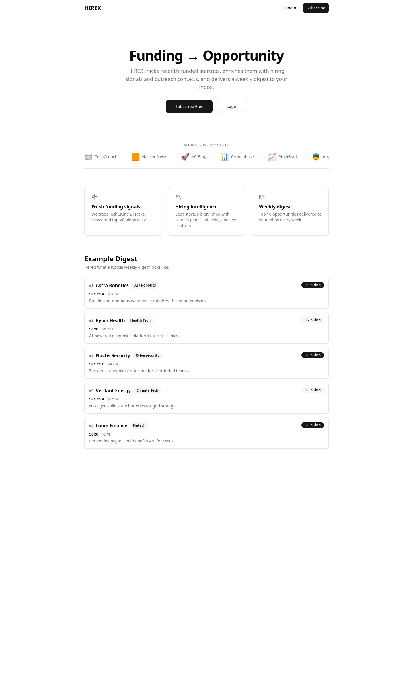

# HIREX

A Cloudflare-native **Funding-to-Opportunity Tracker** that monitors recently funded startups, enriches them with hiring and outreach signals, and delivers a weekly email digest to subscribers.

Built for students and job seekers who want to discover startups shortly after funding events — when hiring momentum is highest.



## What It Does

1. **Polls** public funding sources daily (TechCrunch RSS, Hacker News API, YC Blog)
2. **Extracts** funding details using rule-based heuristics + Workers AI (Llama 3.1 8B)
3. **Enriches** each startup with careers pages, job links, public emails, founder profiles, and a hiring signal score
4. **Ranks** startups using a composite scoring formula (recency, enrichment completeness, hiring signal, contact availability)
5. **Delivers** a weekly top-10 email digest via Resend
6. **Archives** all discovered startups in a searchable web UI behind email OTP auth

## Tech Stack

| Layer | Technology |
|-------|-----------|
| Frontend | React 19, Vite, Tailwind CSS v4, shadcn/ui |
| API | Hono on Cloudflare Workers |
| Database | Cloudflare D1 (SQLite) via Drizzle ORM |
| Background Jobs | Cloudflare Agents (Durable Objects) |
| Async Decoupling | Cloudflare Queues |
| AI Extraction | Cloudflare Workers AI (Llama 3.1 8B) |
| Scraping Fallback | Cloudflare Browser Rendering |
| Email | Resend (OTP, welcome, digest) |
| Auth | Email OTP → HttpOnly session cookie (30-day) |

Everything ships as a **single Cloudflare Workers deployment** — the SPA, API, agents, queue consumers, and cron triggers.

## Architecture

```
┌─────────────────────────────────────────────────────────────────┐
│                     Cloudflare Workers                          │
│                                                                 │
│  ┌──────────┐    ┌──────────────────────────────────────────┐   │
│  │ React SPA│    │              Hono API                    │   │
│  │ (static) │    │  /api/auth/*  /api/subscribe  /api/...   │   │
│  └──────────┘    └──────────────────────────────────────────┘   │
│                                                                 │
│  ┌──────────────────── Data Pipeline ──────────────────────┐   │
│  │                                                          │   │
│  │  SourcePollerAgent (daily cron)                          │   │
│  │       │                                                  │   │
│  │       ▼                                                  │   │
│  │  raw_items (D1) → candidate_funding_items (Queue)        │   │
│  │                        │                                 │   │
│  │                        ▼                                 │   │
│  │              FundingExtractionAgent                       │   │
│  │              (rule-based + Workers AI)                    │   │
│  │                        │                                 │   │
│  │                        ▼                                 │   │
│  │  startups + funding_events (D1)                          │   │
│  │       → startup_enrichment_jobs (Queue)                  │   │
│  │                        │                                 │   │
│  │                        ▼                                 │   │
│  │              StartupEnrichmentAgent                       │   │
│  │              (crawl + search + AI)                        │   │
│  │                        │                                 │   │
│  │                        ▼                                 │   │
│  │              startup_enrichment (D1)                      │   │
│  │                                                          │   │
│  │  DigestAgent (weekly cron)                                │   │
│  │       → rank → top 10 → email via Resend                 │   │
│  │       → digests + digest_items (D1)                      │   │
│  └──────────────────────────────────────────────────────────┘   │
└─────────────────────────────────────────────────────────────────┘
```

### Agents

| Agent | Trigger | Responsibility |
|-------|---------|---------------|
| `SourcePollerAgent` | Daily cron | Fetches RSS feeds and HN API, deduplicates by content hash, stores raw items, enqueues for extraction |
| `FundingExtractionAgent` | Queue consumer | Two-pass extraction (rule-based heuristics, then Workers AI fill-in), upserts startups and funding events |
| `StartupEnrichmentAgent` | Queue consumer | Crawls startup websites for careers/jobs/contact info, searches DuckDuckGo for founders, computes hiring signal |
| `DigestAgent` | Weekly cron | Scores and ranks startups, generates HTML email, stores digest records, sends via Resend |

### Ranking Formula

```
score = recency + source_confidence + enrichment_completeness
      + hiring_signal + contact_availability + cross_source_mentions
```

Rule-based, not ML. Higher scores surface startups that are recent, well-enriched, and actively hiring.

## Project Structure

```
hirex/
├── src/                          # Worker (backend)
│   ├── index.ts                  # Entry: fetch + scheduled + queue handlers
│   ├── env.ts                    # Env type (bindings, secrets)
│   ├── agents/                   # Cloudflare Agents (Durable Objects)
│   │   ├── SourcePollerAgent.ts
│   │   ├── FundingExtractionAgent.ts
│   │   ├── StartupEnrichmentAgent.ts
│   │   └── DigestAgent.ts
│   ├── api/                      # Hono route handlers
│   │   ├── auth.ts               # OTP login/logout/session
│   │   ├── subscribe.ts          # Subscribe/unsubscribe
│   │   └── archive.ts            # Digest list, detail, startup detail
│   ├── db/
│   │   ├── schema.ts             # Drizzle schema (10 tables)
│   │   └── index.ts              # createDb() helper
│   ├── lib/
│   │   ├── auth.ts               # OTP hashing, session cookies, validation
│   │   ├── ai.ts                 # Workers AI helpers
│   │   ├── crawl.ts              # Page fetching, email/link extraction
│   │   ├── email.ts              # Resend wrappers
│   │   ├── extraction.ts         # Rule-based funding extraction
│   │   ├── mappers.ts            # DB row → API response DTOs
│   │   ├── ranking.ts            # Score computation
│   │   └── rss.ts                # Custom RSS/Atom parser
│   ├── types/
│   │   └── index.ts              # Shared API response types
│   └── __tests__/                # Vitest tests (41 total)
├── frontend/                     # React SPA
│   ├── src/
│   │   ├── App.tsx               # Router
│   │   ├── pages/                # Home, Login, Subscribe, Archive, etc.
│   │   ├── components/           # Navbar, StartupCard, DigestCard, ui/
│   │   ├── hooks/useAuth.ts      # Auth state hook
│   │   ├── lib/api.ts            # Typed API client
│   │   └── index.css             # Tailwind v4 + shadcn theme
│   └── vite.config.ts
├── migrations/
│   └── 0001_initial.sql          # All 10 tables + seed sources
├── wrangler.toml                 # Workers, D1, Queues, AI, DOs, crons
├── vitest.config.ts
└── drizzle.config.ts
```

## Database Schema

10 tables in Cloudflare D1:

| Table | Purpose |
|-------|---------|
| `sources` | RSS feeds and API endpoints to poll |
| `raw_items` | Unprocessed items from source polling |
| `startups` | Deduplicated startup records |
| `funding_events` | Funding rounds linked to startups |
| `startup_enrichment` | Hiring signals, contacts, careers pages |
| `subscribers` | Email subscribers |
| `auth_otps` | Hashed one-time passwords (10 min expiry) |
| `sessions` | Hashed session tokens (30 day expiry) |
| `digests` | Sent digest metadata |
| `digest_items` | Startups included in each digest |

## API Routes

| Method | Path | Auth | Description |
|--------|------|------|-------------|
| `POST` | `/api/auth/request-otp` | Public | Send OTP to email |
| `POST` | `/api/auth/verify-otp` | Public | Verify OTP, set session cookie |
| `POST` | `/api/auth/logout` | Public | Clear session |
| `GET` | `/api/auth/session` | Public | Check auth status |
| `POST` | `/api/subscribe` | Session | Subscribe to digest |
| `POST` | `/api/unsubscribe` | Session | Unsubscribe |
| `GET` | `/api/subscription/status` | Session | Check subscription |
| `GET` | `/api/archive` | Session + Sub | List past digests |
| `GET` | `/api/archive/:digestId` | Session + Sub | Digest detail with startups |
| `GET` | `/api/startups/:startupId` | Session + Sub | Startup detail with enrichment |

## Getting Started

### Prerequisites

- [Bun](https://bun.sh) or Node.js 18+
- [Wrangler CLI](https://developers.cloudflare.com/workers/wrangler/) (`npm i -g wrangler`)
- A Cloudflare account with D1, Queues, and Workers AI enabled
- A [Resend](https://resend.com) API key

### Setup

```bash
# Install dependencies
bun install

# Copy environment variables
cp .dev.vars.example .dev.vars
# Edit .dev.vars with your RESEND_API_KEY and SESSION_SECRET

# Create the D1 database
wrangler d1 create hirex-db
# Update the database_id in wrangler.toml

# Run migrations
bun run db:migrate

# Start local development (Wrangler + Vite)
bun run dev
```

### Commands

```bash
bun run dev          # Start Wrangler dev server + Vite (concurrent)
bun run build        # Build frontend + dry-run Worker deploy
bun run deploy       # Build frontend + deploy to Cloudflare
bun run test         # Run all tests (Vitest + Workers runtime)
bun run typecheck    # TypeScript type checking
bun run db:migrate   # Apply D1 migrations
bun run db:generate  # Generate migrations from Drizzle schema
```

### Deploy

```bash
# Set secrets
wrangler secret put RESEND_API_KEY
wrangler secret put SESSION_SECRET

# Deploy
bun run deploy
```

## Testing

Tests run inside a real Workers runtime via `@cloudflare/vitest-pool-workers` (miniflare):

- **41 tests** across 6 test files
- Auth helpers, schema validation, ranking formula, RSS parsing, funding extraction, API route guards
- Uses `wrangler.test.toml` (without AI binding, since miniflare can't emulate Workers AI)

```bash
bun run test
```

## License

Private project. All rights reserved.
